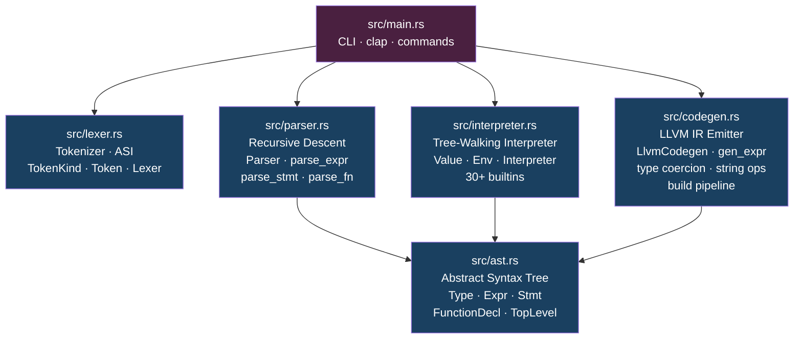
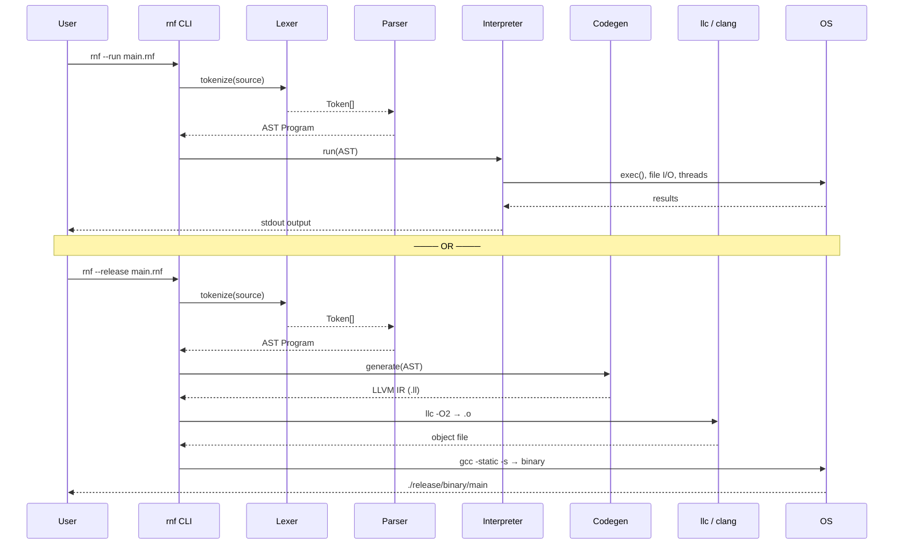
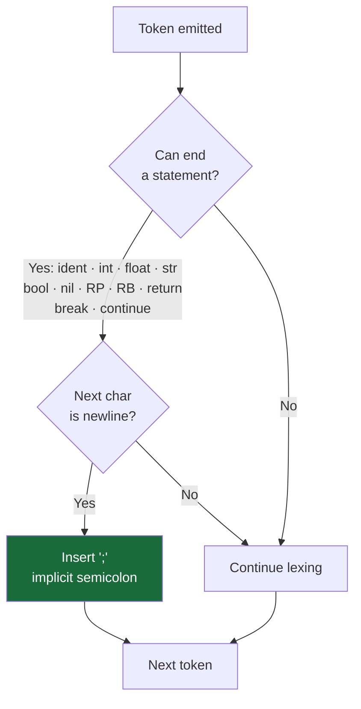
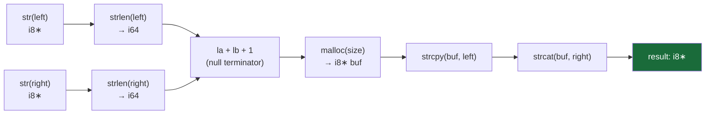
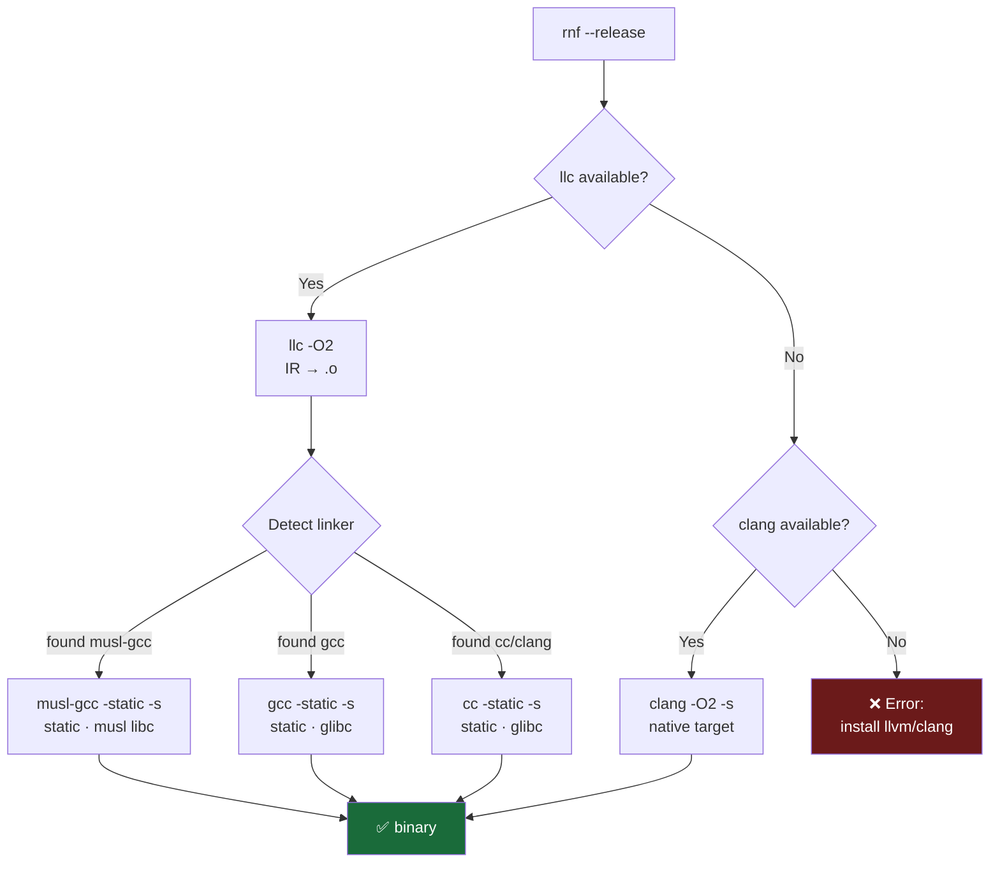
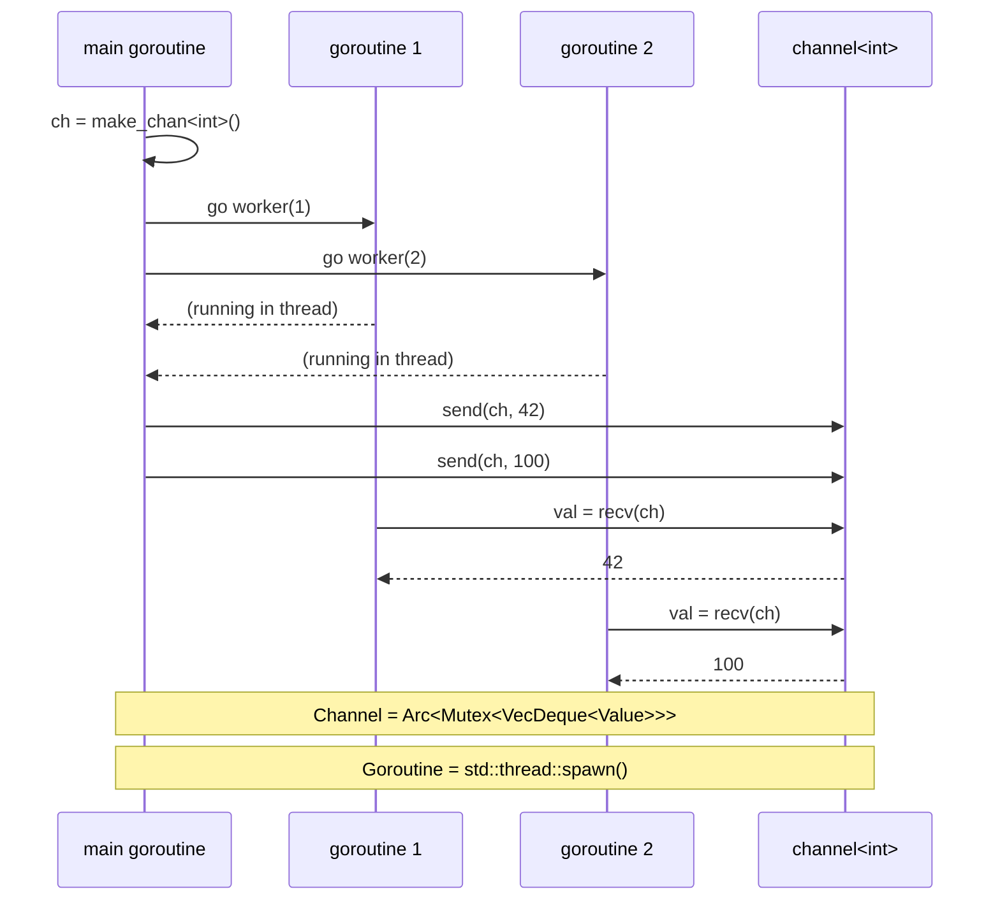
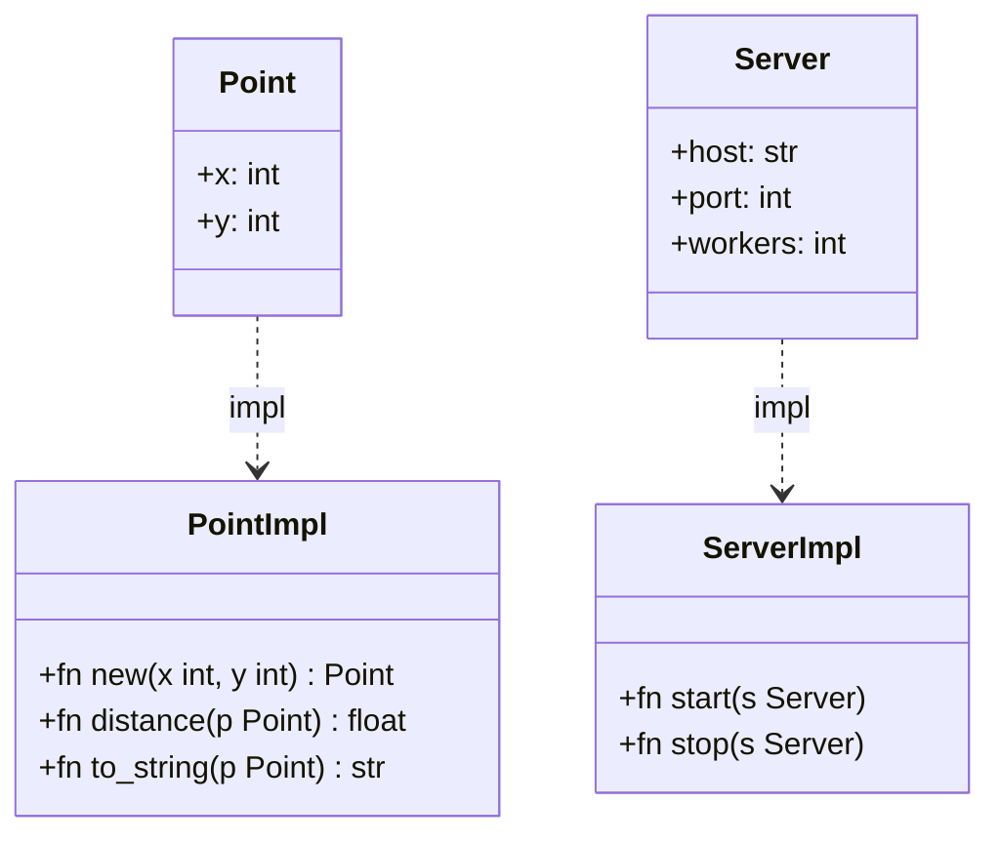

# RNF Language — Architecture & Flow

> Dokumentasi teknis lengkap: kompiler, pipeline, dan desain bahasa RNF.

---

## Compilation Pipeline

```mermaid
flowchart TD
    A[📄 source.rnf] --> B[Lexer\ntokenize + ASI]
    B --> C[Token Stream\n&#91;Fn, Ident, LParen...&#93;]
    C --> D[Parser\nrecursive descent]
    D --> E[AST\nProgram • TopLevel • Stmt • Expr]
    
    E -->|rnf --run| F[🌳 Tree-Walking\nInterpreter]
    F --> G[⚡ Direct Execution\nno compilation]
    
    E -->|rnf --release| H[LLVM IR\nCodegen]
    H --> I[📝 .ll file\nLLVM IR text]
    I --> J{llc}
    J -->|success| K[🗂️ .o Object File]
    J -->|fail| L[clang fallback]
    L --> K
    K --> M{musl-gcc / gcc / cc}
    M --> N[✅ static binary\nstripped · musl/glibc]

    style A fill:#2d2d2d,color:#fff
    style N fill:#1a6b3a,color:#fff
    style G fill:#1a3b6b,color:#fff
    style F fill:#1a3b6b,color:#fff
```



---

## Module Structure



---

## Language Feature Map

```mermaid
mindmap
  root((RNF))
    Variables
      Shell-style ⟹ name = value
      Typed ⟹ name: int = 42
      Global scope
      Mutable by default
    Functions
      Rust syntax ⟹ fn name param: type → ret
      Return type inference
      Recursion
      First class via ptr
    Types
      int · float · str · bool · nil
      ptr⟨T⟩ raw pointer
      chan⟨T⟩ goroutine channel
      struct custom type
      array ⟹ &#91;T&#93;
    Control Flow
      if · else if · else
      while condition
      loop var in range
      break · continue
      return
    Concurrency
      go func_call goroutine
      make_chan⟨T⟩
      send ch value
      recv ch
    System
      exec "shell cmd"
      exec(cmd) capture output
      asm inline assembly
      raw_mem hardware register
      ptr · deref ∗
    Builtins 30+
      IO ⟹ print · eprint
      Convert ⟹ str · int · float · bool
      Array ⟹ len · push · pop
      String ⟹ split · join · trim · replace
      File ⟹ read_file · write_file
      OS ⟹ env_get · env_set · args · exit
```

---

## Type System & Coercion

```mermaid
flowchart LR
    subgraph Primitives
        I["int\ni64"]
        F["float\ndouble"]
        S["str\ni8∗"]
        B["bool\ni1"]
    end

    subgraph Composite
        P["ptr⟨T⟩\ni8∗"]
        C["chan⟨T⟩\nopaque ptr"]
        AR["&#91;T&#93;\ni8∗"]
        ST["struct\nfield map"]
    end

    I -->|"sitofp"| F
    F -->|"fptosi"| I
    I -->|"sprintf"| S
    F -->|"sprintf"| S
    S -->|"atoi"| I
    S -->|"atof"| F
    B -->|"zext"| I
    I -->|"trunc"| B

    S -->|"strcat + malloc"| S
    S <-->|"concat str+int"| I

    style I fill:#2a4060,color:#fff
    style F fill:#2a4060,color:#fff
    style S fill:#2a4060,color:#fff
    style B fill:#2a4060,color:#fff
```



---

## Execution Modes



---

## Automatic Semicolon Insertion (ASI)

Seperti Go, RNF menyisipkan `;` secara otomatis saat baris baru mengikuti token yang bisa mengakhiri statement:



**Contoh:**
```rnf
x = 42          // ← ';' auto disisipkan di sini
y = x + 1       // ← ';' auto disisipkan

fn foo() -> int {
    return 0    // ← ';' auto disisipkan
}               // ← ';' auto disisipkan
```

---

## String Operations in LLVM IR

Setiap `str + str` dikompilasi menjadi safe malloc+strcpy+strcat:



**IR yang dihasilkan:**
```llvm
%la  = call i64 @strlen(i8* %left)
%lb  = call i64 @strlen(i8* %right)
%lc  = add i64 %la, %lb
%ld  = add i64 %lc, 1
%buf = call i8* @malloc(i64 %ld)
%cp  = call i8* @strcpy(i8* %buf, i8* %left)
%cat = call i8* @strcat(i8* %buf, i8* %right)
```

---

## Build & Linker Detection



**Distro requirements:**

| Distro | Install |
|--------|---------|
| AlmaLinux / RHEL / Fedora | `sudo dnf install llvm clang glibc-static` |
| Ubuntu / Debian | `sudo apt install llvm clang musl-tools` |
| Arch Linux | `sudo pacman -S llvm clang musl` |
| macOS | `brew install llvm` |

---

## Concurrency Model



---

## Struct & Impl



**Syntax:**
```rnf
struct Point {
    x: int
    y: int
}

impl Point {
    fn distance(p: Point) -> float {
        return float(p.x * p.x + p.y * p.y)
    }
}

fn main() -> int {
    p = Point { x: 3, y: 4 }
    d = Point::distance(p)
    print("dist = " + str(d))
    return 0
}
```

---

## CLI Commands

```
rnf [COMMAND] [OPTIONS] [FILE]

Commands:
  --run   FILE              Jalankan langsung (interpreter)
  --release FILE            Build static binary
  --release --path P FILE   Build ke path custom
  run FILE                  Alias untuk --run
  release FILE [--path P]   Alias untuk --release
  check FILE                Cek syntax saja
  tokens FILE               Debug: tampilkan token stream
  ast FILE                  Debug: tampilkan AST
  ir FILE                   Emit LLVM IR ke stdout
  init [NAME]               Buat project baru
  version                   Info versi

Output default (tanpa --path):
  release/
  └── binary/
      └── <filename>   ← binary static, stripped

Output dengan --path /custom/dir:
  /custom/dir/
  └── <filename>
```

---

## Keyword Reference

| Keyword | Fungsi | Contoh |
|---------|--------|--------|
| `fn` | Deklarasi fungsi | `fn add(a: int, b: int) -> int` |
| `return` | Return dari fungsi | `return x + 1` |
| `let` | Deklarasi variabel (opsional) | `let x: int = 42` |
| `if` / `else` | Kondisional | `if x > 0 { ... }` |
| `while` | Loop kondisional | `while active { ... }` |
| `loop` | Loop dengan range/array | `loop i in 0..10 { ... }` |
| `break` | Keluar dari loop | `break` |
| `continue` | Lanjut iterasi berikutnya | `continue` |
| `go` | Spawn goroutine | `go worker(id)` |
| `exec` | Jalankan perintah shell | `exec "ls -la"` |
| `struct` | Definisi struct | `struct Point { x: int }` |
| `impl` | Implementasi method | `impl Point { fn new() }` |
| `ptr` | Deklarasi pointer | `ptr p = &x` |
| `asm` | Inline assembly | `asm { "nop" }` |
| `raw_mem` | Akses memori langsung | `raw_mem(0x4000)` |
| `make_chan` | Buat channel | `make_chan<int>()` |
| `send` | Kirim ke channel | `send(ch, value)` |
| `recv` | Terima dari channel | `val = recv(ch)` |
| `pub` | Public visibility | `pub fn exported()` |
| `use` | Import modul | `use mymodule` |
| `nil` | Null value | `x = nil` |
| `true` / `false` | Boolean literal | `active = true` |
| `in` | For-range separator | `loop i in range` |
| `mod` | Module declaration | `mod utils` |

---

## Operator Precedence

| Tingkat | Operator | Asosiasi |
|---------|----------|----------|
| 1 (tertinggi) | `()` `[]` `.` | kiri → kanan |
| 2 | `!` `-` (unary) `&` `*` | kanan → kiri |
| 3 | `*` `/` `%` | kiri → kanan |
| 4 | `+` `-` | kiri → kanan |
| 5 | `<` `>` `<=` `>=` | kiri → kanan |
| 6 | `==` `!=` | kiri → kanan |
| 7 | `&&` | kiri → kanan |
| 8 (terendah) | `\|\|` | kiri → kanan |
